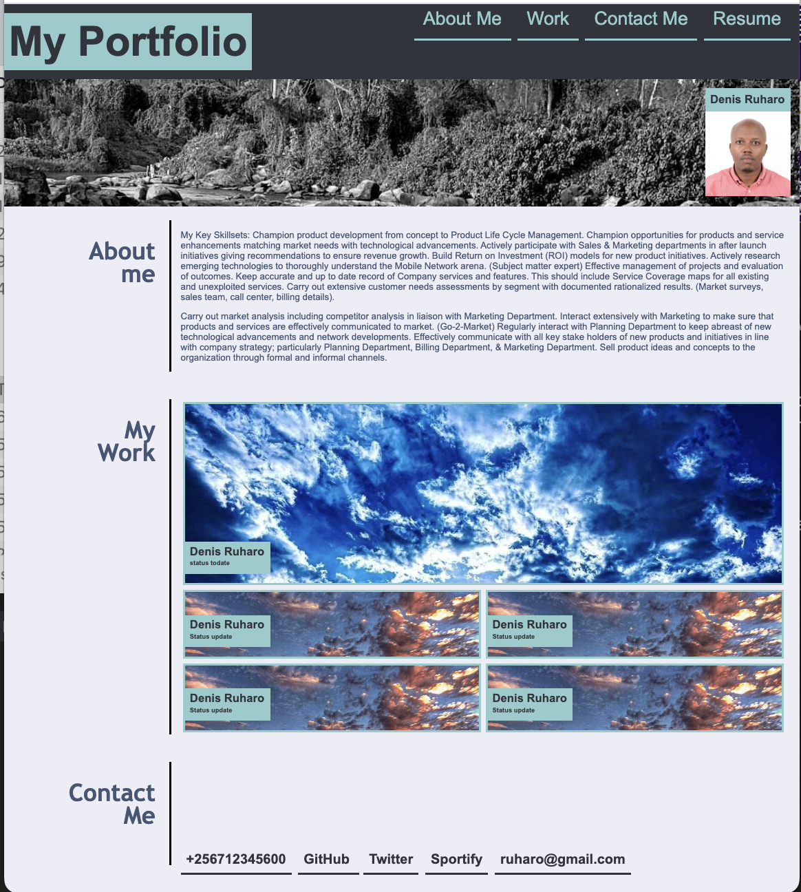

# MY PORTFOLIO PAGE
## INSTALLATION AND UPDATES MADE:
1. The page was built using HTML5 and CSS3, deployed using Github pages and is hostested on Github. Link and the screen shot are attached herewith.
a) 
b) link to github pages (https://github.com/druharo/Challenge2)

2. 5 key changes were made and pushed to github repository. initial  commit, update to the code (HTML and CSS), inserting images, updating the media query and creation of page in Github.

3. A number of challenges we encountered during thje development of the site especially with responsive design and inserting background images that can size to different medium.

## MOTIVATION:
The website was developed as a starting point to building my portfolio site for future employes to veiw, contribute or anaylse my works. 

## LICENSES:
The code has an MIT License.

## CREDITS:
UMN Bootcamp Tutoring Staff and www.w3schools.com.

